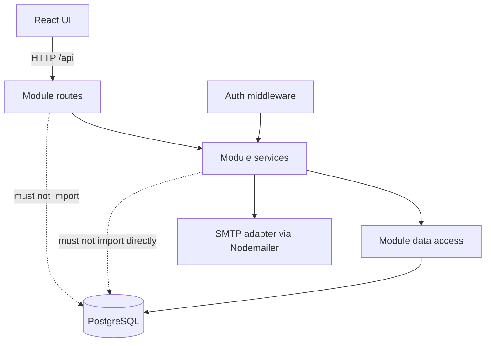
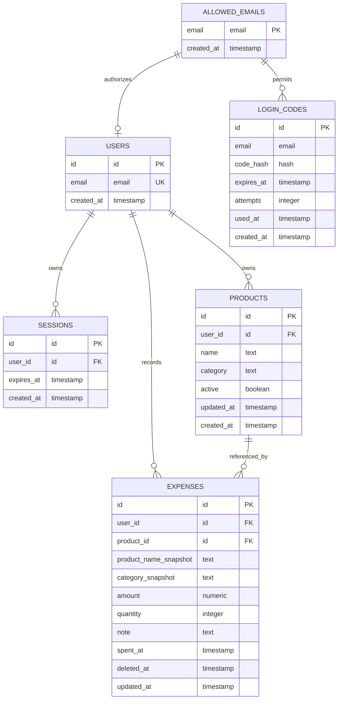
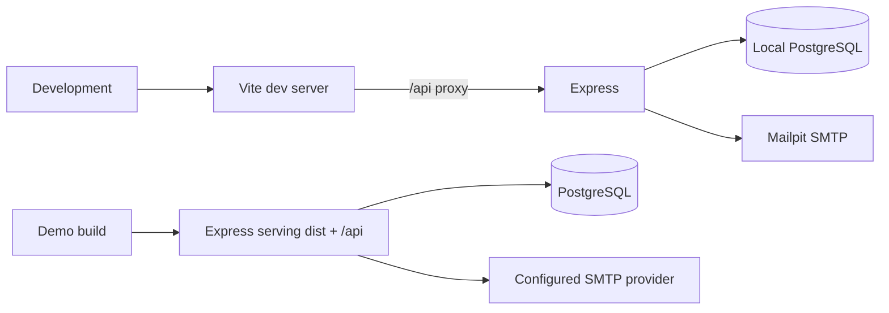

# Architecture Spine — Sales Tracker

## Design Paradigm

Sales Tracker is a **modular monolith with layered internals**: one repository and one deployable application containing the React client, Express API, and PostgreSQL database. The server is divided into Auth, Products, Expenses, and Dashboard feature modules. Each module has routes, services, and data access.

## Invariants & Rules

### AD-1 — Feature modules own their persistence boundary

- **Binds:** Auth, Products, Expenses, Dashboard, all server code
- **Prevents:** Routes or unrelated modules reaching into tables and bypassing business rules
- **Rule:** Routes handle HTTP and Zod validation, services own business rules, and data-access code owns Prisma queries. Routes and services never import Prisma directly. Modules communicate through services; no module imports another module's data-access layer.

### AD-2 — All application data is tenant-scoped by session identity

- **Binds:** Every authenticated API route and every user-owned entity
- **Prevents:** A client changing an identifier to read or mutate another user's data
- **Rule:** Authentication middleware resolves the session to `user_id`; every Products, Expenses, and Dashboard data-access operation requires that `user_id` as a server-derived predicate. Client-provided ownership fields are ignored.

### AD-3 — Authentication is passwordless and allowlisted

- **Binds:** Login-code issuance, verification, user creation
- **Prevents:** Password storage, account enumeration, reusable login codes, and unapproved access
- **Rule:** Normalize email before lookup. Only an `allowed_emails` record may receive a code, but approved and unapproved requests return the same generic response. Codes use `crypto.randomInt`, are hashed at rest, single-use, expire after 10 minutes, lock after 5 failed attempts for the remainder of that code's validity, and are rate-limited before allowlist disclosure at three requests per email per 10 minutes. Verification locks the login-code row and performs a conditional state transition so concurrent requests cannot consume one code twice.

### AD-4 — Sessions are server-side and opaque

- **Binds:** Successful login, authenticated requests, logout
- **Prevents:** User data or authorization claims being trusted from the browser
- **Rule:** Store sessions in PostgreSQL with a seven-day expiry and only a hash of the random session token. Set only the opaque token in an HTTP-only cookie using `SameSite=Lax` and `Secure` over HTTPS. Resolve and enforce expiry on every protected request, rotate the token after login, validate the request `Origin` for state-changing requests, and delete the session on logout.

### AD-5 — Expenses are the authoritative spending ledger

- **Binds:** Expense creation, editing, deletion, and all dashboard totals
- **Prevents:** Historical totals changing because of current product fields or derived calculations
- **Rule:** Record amount actually paid, quantity bought, note, and `spent_at` on each expense. Dashboard queries sum only non-deleted expenses; they never derive spending from product fields.

### AD-6 — Historical product context is server-snapshotted

- **Binds:** Expense creation and product changes on expense edits
- **Prevents:** Product edits or archival rewriting historical product/category reports, and clients forging report dimensions
- **Rule:** On expense insert, the server reads an active product and writes non-null `product_name_snapshot` and `category_snapshot`. Normal expense edits preserve both snapshots. Changing `product_id` is allowed only to another active product and re-snapshots both values from it. The client never supplies snapshot values, and reports group by snapshot columns. Snapshot fields are immutable after the transaction that wrote them.

### AD-7 — Ledger correction preserves references

- **Binds:** Expense and product lifecycle operations
- **Prevents:** Broken historical references and accidental disappearance from audit-oriented views
- **Rule:** Expenses may update amount, quantity, note, date, and product through validated, user-scoped services. A soft-deleted expense cannot be edited or restored; repeated deletion is an idempotent no-op. Deletion sets `deleted_at`, and all dashboard and expense-list queries exclude it. Products use `active=false` archival and are never hard-deleted; archived products remain valid references for existing expenses but cannot be selected for new expenses or product changes.

### AD-8 — Persistence changes are transactional where facts must agree

- **Binds:** Login verification/session creation and expense writes
- **Prevents:** A successful login without a session, or a partially written expense
- **Rule:** Code verification, user creation when needed, and session creation commit atomically. Verification locks the code row and uses a case-insensitive unique user email with conflict-safe upsert. Expense create/update/delete and snapshot reads commit as one transaction, with product ownership and active-state checks inside the transaction; product-row locking or serializable retry is used when snapshot consistency depends on a concurrent product change.

### AD-9 — Dashboard is a read-only projection

- **Binds:** Dashboard service and aggregate queries
- **Prevents:** Dashboard code becoming a second source of truth or mutating ledger data
- **Rule:** Dashboard exposes current-month and all-time totals, spending over time, and spending by snapshot product and category. Its data-access layer is read-only and may use only parameterized `SELECT` Prisma `$queryRaw` statements for aggregates Prisma cannot express cleanly; no raw mutation SQL is permitted. Dashboard data access may read Expenses tables directly for these projections but never calls the Expenses data-access layer or mutates its data.

### AD-10 — One-origin application delivery

- **Binds:** Browser client, API, local development, production build
- **Prevents:** Divergent API origins, unnecessary CORS/session-cookie complexity, and a split deployment
- **Rule:** Vite proxies `/api` to Express during development. Production serves the Vite build from Express, with the API and client on one origin and one port. No microservice deployment is introduced for this scope.



### AD-11 — Reporting uses one UTC time-boundary policy

- **Binds:** Dashboard totals, monthly grouping, and time-series queries
- **Prevents:** Different modules interpreting “this month” or expense dates differently
- **Rule:** Store timestamps in UTC and calculate ranges as half-open intervals `[start, end)`. A shared reporting date-range service supplies all dashboard queries; the user's display timezone is a presentation concern and never changes ownership or ledger selection.

### AD-12 — Client/server contracts are explicit before implementation

- **Binds:** React API client, Express routes, validation schemas, dashboard DTOs
- **Prevents:** Client and server drifting on money precision, dates, soft-delete state, or archived-product behavior
- **Rule:** Define request and response DTOs before implementing each module. Monetary values cross JSON boundaries as decimal strings; timestamps use ISO 8601 UTC strings; snapshots and ownership are response-only; mutation responses include `updated_at` for concurrency checks.

### AD-13 — Mutations use current-record preconditions

- **Binds:** Product and expense updates and archival
- **Prevents:** A stale browser silently overwriting a newer correction
- **Rule:** Products and expenses carry `updated_at`. Update and archive operations require the client's last-seen value and fail with a conflict when it no longer matches; soft-delete remains idempotent.

## Consistency Conventions

| Concern | Convention |
| --- | --- |
| Naming | TypeScript camelCase; database snake_case; modules and routes use capability names; schemas are colocated with the route boundary; archived products remain addressable by ID. |
| Data & formats | JSON over `/api`; timestamps stored and exchanged in UTC; money uses PostgreSQL `numeric(12,2)` and crosses JSON as decimal strings; quantities are positive integers; emails are normalized before persistence. |
| Validation & errors | Zod validates untrusted request bodies, query parameters, and route parameters; services enforce ownership and business rules; responses use a consistent `{ error: { code, message } }` shape without leaking allowlist or authentication state. |
| Auth & state | Session identity is server-derived; cookies are HTTP-only; login codes and sessions are invalidated atomically; dashboard reads exclude `deleted_at IS NOT NULL`. |
| Configuration | Secrets and connection details come from environment variables; `.env` is local-only and ignored; Mailpit is the development SMTP target and an external SMTP provider is selected by configuration for demonstration. |
| Database integrity | IDs use one consistent generated type; normalized emails have case-insensitive uniqueness; foreign keys include tenant ownership where needed; snapshot fields are non-null; amount and quantity have positive-value checks; `deleted_at` and `active` are indexed with user/product/date indexes used by dashboard and ledger queries. |
| Seed and migrations | `prisma migrate` is the only schema migration path. The seed is deterministic, idempotent, transactional, creates allowlist/catalog/demo expenses with correct snapshots, and refuses to run against a production-marked environment. |
| Operational failures | Login email failures return the same generic login response and are logged without codes; SMTP, database, and migration configuration failures fail closed with actionable server logs but no secrets in responses. |

## Stack

| Name | Version |
| --- | --- |
| Node.js | 24.21.0 LTS line |
| TypeScript | 7.0.2 |
| React | 19.3.0 |
| Vite | 8.3.1 |
| Express | 5.2.1 |
| PostgreSQL | 18.6 |
| Prisma ORM / Prisma Migrate | 6.19.3 stable line |
| Zod | 4.6.5 |
| Nodemailer | 10.0.13 |

Versions were checked against official documentation and the package registry on 2026-09-30. React, TypeScript, and Vite were checked against their official documentation and package metadata. Prisma 8.0.0-rc.19 was visible in the registry but is not selected for this capstone; the stable 6.19.3 line is used instead. The package manifest and lockfile become the implementation source of truth.

## Structural Seed

```text
sales-tracker/
	client/                 # Vite React TSX app, CSS Modules, API client
	server/
		modules/
			auth/               # routes, services, data access, code/session policy
			products/           # catalog routes, services, data access
			expenses/           # ledger routes, services, data access
			dashboard/          # read-only aggregate routes, services, data access
		middleware/           # session resolution and request concerns
		infrastructure/      # Prisma client, SMTP/Nodemailer, configuration
	prisma/
		schema.prisma
		migrations/
		seed.ts               # allowlist and demo catalog/expense data
	dist/                   # generated Vite output served by Express
```





## Capability → Architecture Map

| Capability / Area | Lives in | Governed by |
| --- | --- | --- |
| Passwordless allowlisted login | Auth module | AD-3, AD-4, AD-8 |
| User-owned product catalog and archival | Products module | AD-1, AD-2, AD-7 |
| Spending record create/edit/soft-delete | Expenses module | AD-2, AD-5, AD-6, AD-7, AD-8, AD-12, AD-13 |
| Monthly/all-time totals and time series | Dashboard module | AD-2, AD-5, AD-9 |
| Spending by product and category | Dashboard module | AD-2, AD-6, AD-9 |
| React dashboard and product forms | Client | AD-10 and API conventions |
| Local development and demonstration email | Infrastructure/configuration | AD-4, AD-10 and configuration convention |

## Deferred

- Exact HTTP route names: decide while writing the API contract; the DTO shapes, money/date formats, ownership rules, and conflict behavior are fixed by AD-12 and AD-13 before implementation begins.
- Exact database ID types, indexes, and Prisma naming mappings: decide in the Prisma schema; revisit during ERD review.
- SMTP provider for the final demonstration: use Mailpit locally and choose a provider when a real inbox is required.
- Deployment beyond the developer's machine: out of scope unless the school requires hosting; revisit before the architecture chapter's deployment section.
- Dashboard chart library details and visual layout: choose during UX and implementation; they do not change data ownership.
- Backup, monitoring, and production incident operations: not owned by this local capstone spine; revisit if the app is deployed for ongoing use.
